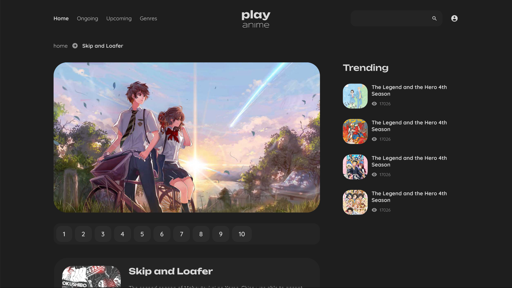

# playanime


### About

Playanime is an anime streaming platform that boasts a vast collection of anime series that caters to all tastes. Whether you prefer action, romance, comedy, or horror, you can find it all on playanime.

### Development

- Install Dependencies.

```sh
npm install
```

- Run Development Server.

```sh
npm start
```

- Run Sass Configuration.

```sh
npm run sass
```

---

### Technologies Used

##### Back End

- [Node](https://nodejs.org)
- [Express](http://expressjs.com)
- [Cheerio](https://cheerio.js.org/)

##### Front End

- [React](https://reactjs.org)
- [Sass](https://sass-lang.com/)

##### State Management

- [Context API](https://legacy.reactjs.org/docs/context.html)

### Screenshots

#### Home


#### Stream


